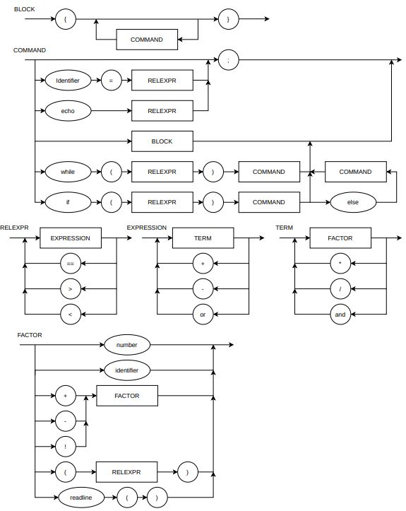

# LogComp
#### Repositório para a disciplina de Lógica da Computação  

###### Guilherme Leite

###### Diagrama Sintático

###### EBNF

    expr   : term  {("+"|"-")term}
    term   : factor{("*"|"/")factor}
    factor : int   {int}
    int    : 0 | 1 | 2 | 3 | ... | 9
